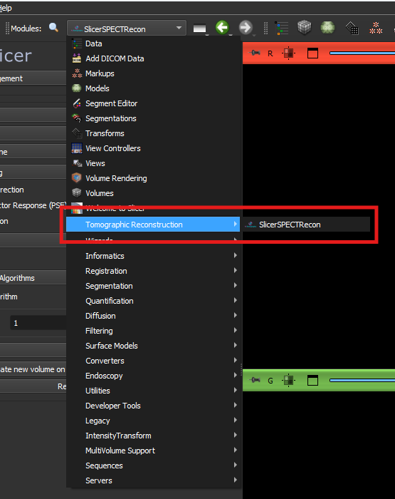

# SPECT Tomographic Reconstruction 3D Slicer Extension
An early prototype for SPECT tomographic reconstruction in 3D slicer; this extension the python library **PyTomography**. In order to use

1. Clone this repository locally
2. On 3D slicer go ''Edit->Application Settings->Modules'' and add `.../slicer_spect_recon/SlicerSPECTRecon` to "Additional Module paths" where `...` is the path where you cloned the repository.
3. Restart 3D Slicer so that it instatiates the modules and loads the `Tomographic Rconstruction` category.
4. Under the Modules dropdown menu, there should now be a "Tomographic Reconstruction" category which contains the extension.

