# Module Description

This module enables the reconstruction of raw SPECT projection data, providing customizable options for image modeling and image reconstruction. This document is a user manual for using the extension.

# Loading DICOM Data

The `SlicerSPECTRecon` extension uses DICOM data imported via the DCM data loader of 3D slicer. All data used in reconstruction (e.g. SPECT projection data and CT images for attenuation correction) must first be loaded into 3D slicer as follows:

1. Go to *File* → *Add DICOM Data* or simply click 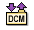
2. Click *Import DICOM Files*
3. Select the folder containing the DICOM files you wish to import, and click "Import" in the file explorer.
4. In the "Dicom Database" on the right hand side, click on the patient name, select the files you want to important, and click "Load" (see Figure 0).

 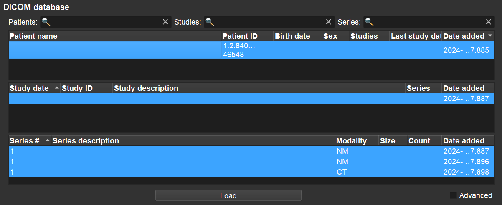

# Extension Instructions

The purpose of this module is to enable reconstruction of raw SPECT projection data in 3D slicer with a variety of system modeling techniques and algorithms. Similar to reconstruction workflows from clinical software, the extension is composed of multiple steps

1. **Input Data:** The input data component is used to select the projection data for reconstruction and the corresponding energy window used for reconstruction. Users first select the projection data (previously loaded into slicer) from the drop down menu, and then select the energy window they wish to reconstruct. For uses cases consisting of multiple bed positions (common in some patient scans), multiple projections can be selected; after reconstruction, they are automatically stitched together.

 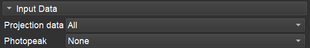

2. **System Modeling:** The system modeling component is used to specify the required phenomenon to consider during reconstruction: that is, attenuation correction, collimator detector response modeling, and scatter correction.
    * *Attenuation Correction*: The user optionally selects a pre-loaded CT image from the drop down menu; this CT image is automatically converted into an attenuation map and used for attenuation correction during reconstruction.
    * *Collimator Detector Response Modeling*: The user specifies the collimator code (see [here](https://pytomography.readthedocs.io/en/latest/external_data.html)) corresponding to the collimator used during acquisition. The intrinsic resolution of the scintillator crystals (in FHWM) can also be included (typically around 0.36cm - 0.38cm for NaI crystals).
    * *Scatter Correction*: The module currently supports dual energy window and triple energy window scatter correction. Users select the upper and lower adjacent windows to the photopeak. If one of the windows is left as `None`, it is assumed there are no counts in that window.

 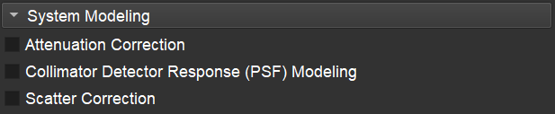

3. **Likelihood:** This module allows users to choose their preferred likelihood function. It's currently fixed to the `PoissonLogLikelihood` option as this statistically characterizes the count distribution obtained in SPECT imaging, but future releases might expand on other options.

 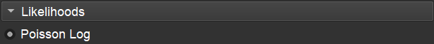

4. **Reconstruction Algorithm:** The reconstruction algorithms module allows users to select the algorithm used to reconstruct the raw projection data. Currently, the ordered subset expectation maximum (OSEM), block sequential regularized expectation maximum (BSREM), and ordered subset maximum a posterior one step late (OSMAPOSL) are supported.
    * Regularized algorithms can include a prior function from options such as `RelativeDifferencePenalty`, `LogCosh`, and `Quadratic` priors. Parameters for each prior are specified in the [PyTomography documentation](https://pytomography.readthedocs.io/en/latest/autoapi/pytomography/priors/index.html)
    * Regularizers may also use an additional anatomical image for weighting the contribution from nearby voxels. Users select the anatomical image (such as the CT used for attenuation correction), and the anatomical image will be used.

 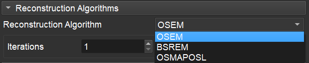

5. **Output:** This section allows users to specify the name of the resulting volume created after reconstruction in 3D slicer.

 

**DISCLAIMER: This plugin is for academic purposes only and it is not recommended for use in clinical environment.**

# Additional Features

1. **Data Converters:** Since 3D slicer only supports data in the DICOM format, this section contains tools for converting projection data and attenuation maps from various formats into DICOM. The module currently supports conversion of the SIMIND Monte Carlo data format. Once data has been converted, it will be saved to a DICOM file at a specified location on the users computer, which then needs to be loaded via the Slicer DICOM image loader.
    * *SIMIND Data Converter*: The output of a SIMIND simulation may include multiple energy windows: users specify how many energy windows they want to include in the DICOM file in the "Number of energy windows" section. Since DICOM data is stored in units of counts, and SIMIND data is output in counts/second/MBq (or in some cases counts/second/(MBq/mL)) users must specify a time per projection (second), and scale factor (MBq or MBq/mL) to multiply the SIMIND data by. The noiseless SIMIND data is then sampled according to a Poisson distribution with the given "Random Seed". Users need to select the header files for each window they want to provide (".h00" files); these files must be in the same directory as the data files (".a00" files). Finally, the user must provide a patient name to give to the generated data, and choose a location to save on the computer. To convert a SIMIND attenuation map into DICOM format, users must select the header files (".hct"); this file must be in the same directory as the data file ("ict"). The user then specifies the location on their computer where to save the resulting files.

 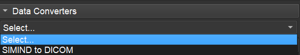

 The module has a SIMIND to DICOM converter to permit reconstruction of SIMIND Monte Carlo data.

 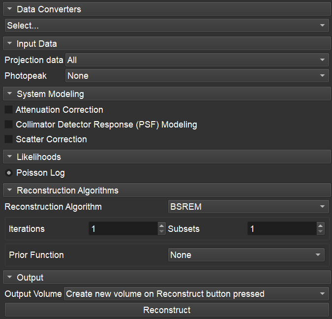

# Installation

**Prerequisite**: 

- Latest version and release of 3D Slicer (5.6.1) 

The *SlicerSPECTRecon* module, when released to the extension manager, shall be installed automatically from *View* -> *Extension manager* -> *Install Extensions* or directly from 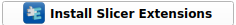 in Slicer Home. However, it can also be downloaded or cloned  from [https://github.com/PyTomography/slicer_spect_recon.git](https://github.com/PyTomography/slicer_spect_recon.git). 

In the case of download, the insallation proceeds as follows:

1. Download the zip file (Figure 3.0) and extract it in a personal directory folder. It will contain, among other things, the folder SlicerSPECTRecon with the SlicerSPECTRecon.py file
2. Open Slicer and click 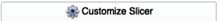, or alternatively *Edit* -> *Application Settings*. 
3. In *Modules* -> *Additional module paths*, add the path to the folder containing the module files (Figure 3.1).
4. Restart Slicer to apply the changes.

 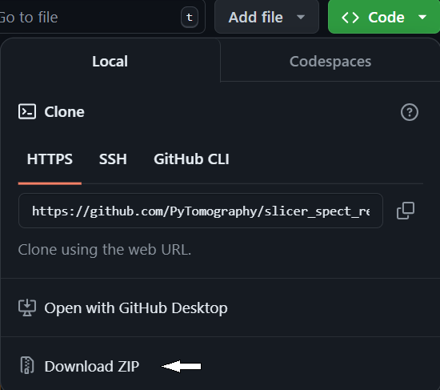

In the case of cloning from GitHub, the insallation proceeds as follows:
 
1. In GitHub copy URL from "Clone with HTTPS" (Figure 3.2)
2. Open terminal in a personal directory folder and execute the line: <pre><code>git clone https://github.com/PyTomography/slicer_spect_recon.git </code></pre>
(i.e. "git clone" plus the copied URL).
This will download a folder called *slicer_spect_recon*, with  all the necessary files for the module 
3. Open Slicer and click , or alternatively *Edit* -> *Application Settings*. 
4. In *Modules* -> *Additional module paths*, add the path to the folder containing the module files (Figure 3.1).
5. Restart Slicer.

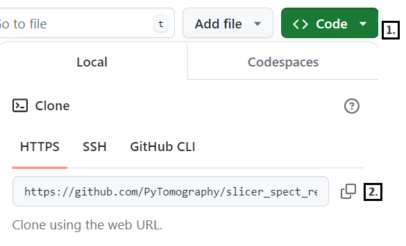

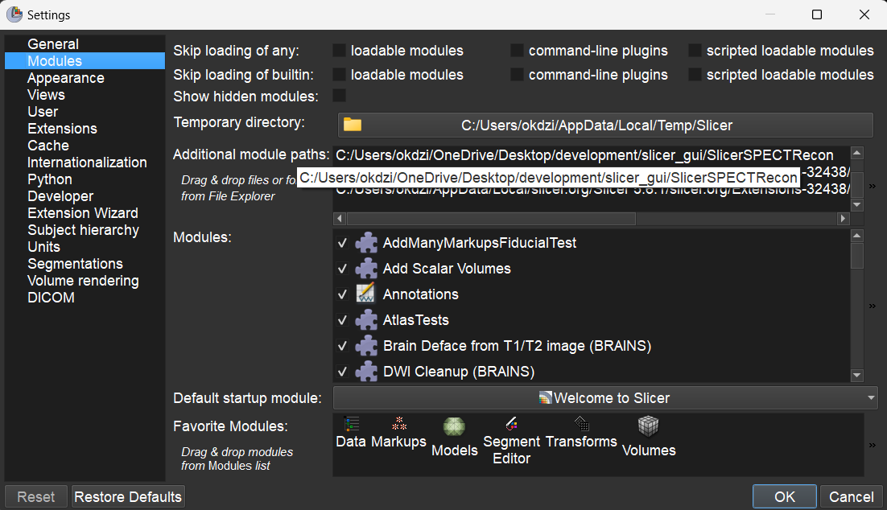

Once Slicer is restarted, the SlicerSPECTRecon module will be available from *All Modules* → *Tomographic Reconstruction* → *SlicerSPECTRecon* (Figure 3.3)

# Limitations

1. The module requires some basic knowledge of Slicer modules from the user, specifically DICOM import and data management.
2. Currently, the software only supports dual head SPECT systems with parallel hole collimators (and has only been tested on Siemens Symbia and GE Discovery scanners). 
3. The module requires data to be in the DICOM format (but has a converter for other formats). Currently the only supported format for conversion to DICOM is SIMIND.
